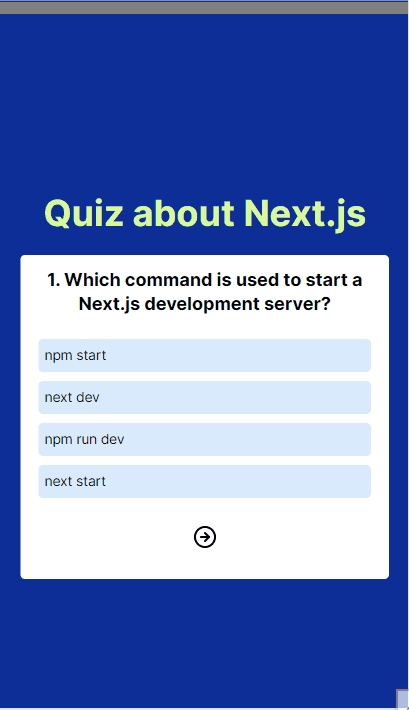

# Quiz App 💭

Quiz App developed as a study project to enhance my React skills and test users' knowledge on Next.js documentation topics. This project serves both as a learning tool for myself and a platform for users to evaluate their understanding of Next.js

Users can navigate through questions, select answers, and their responses are stored for evaluation. Upon completion, a modal displays their final score, performance message, and a comparison between their answers and the correct ones for review.

## Features 💡

- **Stored Responses**: The application stores user responses throughout the quiz for evaluation upon completion.

- **Completion Modal**: Upon completing the quiz, users are presented with a modal displaying their final score and a comparison between their answers and the correct answers.

- **Performance Feedback**: Based on the user's score, the modal displays a corresponding message to provide feedback on their performance.

- **Progress Bar**: A visual indicator shows the user's progress towards completing the quiz

- **Response Alert**: An alert prevents users from advancing to the next question without selecting an answer.

 

## Technologies ⚙️

## Overview 

